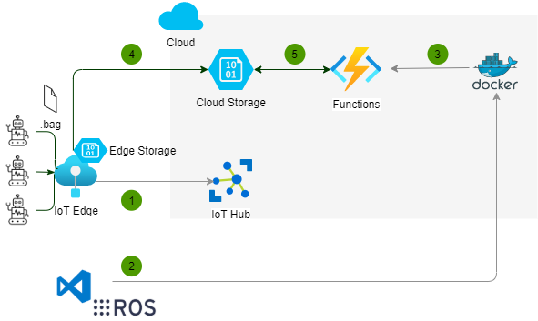

# Run ROS Cartographer in Azure Functions

This sample shows how to run [ROS](https://www.ros.org/) and [Cartographer](https://github.com/cartographer-project/cartographer) commands in Azure Functions. It is one way to implement the following use case -

1. A robot moves around a space and generates lidar data continuously in ros bag files.
1. The bag files are uploaded to the cloud.
1. An Azure Function watches the cloud blob storage, and upon the creation of a new blob, runs ROS and/or Cartographer commands to process the bag file, for example, compute a map of the robot based on the lidar data.

## Design options

There are multiple options to implement this use case, each with its pros and cons when it comes to capability, ease of implementation, and cost. Below are a few options considered.

### Upload data from robot to the Cloud

* [Azure IoT Hub for ROS](https://github.com/microsoft/ros_azure_iothub) enables an Azure IoT device to subscribe to ROS topics and send the topic messages to Azure IoT Hub. However, Azure IoT Hub has a device-to-cloud message size limit of 256KB, making it an inadequate option for uploading lidar data.
* [Azure IoT Hub File Upload](https://docs.microsoft.com/en-us/azure/iot-hub/iot-hub-csharp-csharp-file-upload) lets you upload files from device to cloud using Azure IoT SDK. However, if internet connection from the device to the cloud is unavailable, upload will fail, and the application will need to handle the failure.
* [**Azure IoT Edge Blob Storage**](https://docs.microsoft.com/en-us/azure/iot-edge/how-to-store-data-blob?view=iotedge-2020-11) can run on an Azure IoT Edge device, and automatically upload files to the cloud when internet connection is available. It can also optionally delete local files after they are successfully uploaded. We use this option to upload data to the cloud in this sample.

### Process ros bag files in the cloud

Data processing happens in the cloud when a new blob is uploaded. There are multiple ways to subscribe to blob upload events in Azure. For example,

* [**Azure Event Grid**](https://docs.microsoft.com/en-us/azure/storage/blobs/storage-blob-event-overview#the-event-model) will send data to a subscribing endpoint when a blob is uploaded.
* If you use Azure IoT Hub File Upload, then [Azure IoT Hub File Upload notification](https://docs.microsoft.com/en-us/azure/iot-hub/iot-hub-devguide-file-upload#file-upload-notifications) lets you receive notifications using Azure IoT SDK once the robot uploads a file to blob storage.  

In this example, since we use Azure IoT Edge Blob Storage rather than Azure IoT Hub File Upload, we use Event Grid for blob upload notification. There are still multiple options to process the blob once a new blob is detected.

* [Azure Container Instance](https://docs.microsoft.com/en-us/azure/container-instances/container-instances-overview) is the easiest way to run any Docker container if there's no requirement for multi-container orchestration. You can install ROS and Cartographer in a Docker image, and write code using Azure SDK to subscribe to Event Grid events for blob upload.
* [App Service using a custom container](https://docs.microsoft.com/en-us/azure/app-service/tutorial-custom-container?pivots=container-linux) can run a web app from a custom Docker container in Azure App Service. I have not tested it myself, but supposedly you can run a non-web app by creating a Linux container and run a loop in the startup application. Similar to Azure Container Instance, you need to write code to susbscribe to Event Grid for blob upload notifications.
* [**Azure Function with Custom Container**](https://docs.microsoft.com/en-us/azure/azure-functions/functions-create-function-linux-custom-image?tabs=bash%2Cportal&pivots=programming-language-python) has a built-in Blob storage or Event Grid trigger as well as input/output bindings to Blob Storage, so it requires least amount of coding. This sample uses the Blob storage trigger since it's the simplest.
  >> [Blob storage trigger uses a less efficient polling mechanism to detect blob changes as compared to Event Grid](https://docs.microsoft.com/en-us/azure/azure-functions/functions-bindings-storage-blob-trigger?tabs=csharp). However for scripting languages such as Python, when using Event Grid trigger, you [can't use function.json to bind the blob that triggered the function to blob input binding](https://github.com/Azure/azure-functions-host/issues/7013), so you'll have to write extra code to parse the event and access the blob using Azure SDK. There's also a [Event Grid based Blob trigger](https://docs.microsoft.com/en-us/azure/azure-functions/functions-event-grid-blob-trigger?tabs=csharp), but at the time of this writing (Aug 2021), it's still in preview.

The above options also differ in cost. For example, using the Azure pricing calculator, to get a pay-as-you-go compute instance of 2 vcpu cores and 8GB memory in North Central US region, here's the rough cost per month at the time of this writing (Aug 2021).

* [Azure Container Instance - Linux](https://azure.microsoft.com/en-us/pricing/details/container-instances/): $85
* [Azure App Service - Linux, P1v3](https://azure.microsoft.com/en-us/pricing/details/app-service/linux/): $138
* [Azure Functions premium plan](https://azure.microsoft.com/en-us/pricing/details/functions/) required for custom container: $324

## How it works

The following diagram illustrates how this sample works:

Steps 1, 2, and 3 happen at development/deployment time, 4 and 5 happen at runtime.

1. Create an Azure IoT Edge device, register it with Azure IoT Hub, and deploy [Azure Blob Storage on IoT Edge](https://docs.microsoft.com/en-us/azure/iot-edge/how-to-store-data-blob?view=iotedge-2020-11). Also deploy an Azure Blob Storage in the cloud so that the edge storage is configured to automatically upload to the cloud.
1. [Create a custom Docker container from a Azure Function base image and install ROS and Cartographer packages](Dockerfile). [Implement application logic](BlobExample/__init__.py) and deploy the image to a container registry such as Docker Hub or Azure Container Registry.
1. [Deploy the custom container based Azure Function app](https://docs.microsoft.com/en-us/azure/azure-functions/functions-create-function-linux-custom-image?tabs=bash%2Cportal&pivots=programming-language-python#create-and-configure-a-function-app-on-azure-with-the-image) to pull the Docker image from the container registry.
1. The robots generate ros bag files and send them to the Azure Blob Stroage on the IoT Edge. The files are automatically uploaded to the cloud storage.
1. The Azure Function is [triggered](BlobExample/function.json#L6) whenever a new blob is created, it then uses [ROS or Cartographer tools and libraries to process the file](BlobExample/__init__.py#L24) and uses the [output blob storage binding](BlobExample/function.json#L13) to automatically save the output back to the cloud blob storage.

## Known issue

* When testing the function locally, everytime the Docker container starts, all the blobs already in the IoT Edge storage will trigger the function. This is expected because the trigger tracks [blob receipts](https://docs.microsoft.com/en-us/azure/azure-functions/functions-bindings-storage-blob-trigger?tabs=csharp#blob-receipts) to determine if a blob has already been processed. When running locally, part of the function name is the container id.

## What's next?

1. Load test based on the number of robots and the frequency they generate bag files. Also assess if we need to use Event Grid trigger instead of Blob storage trigger if detection latency is high.
1. Experiment what's required in order to run ROS or Cartographer code natively in C++ or Python rather than spinning up a process to run command line tools.
1. Experiment using Azure App Service or Azure Container Instance if there's a need to bring down cost.
1. Explore using Managed Identity for the function to access blob storage.
